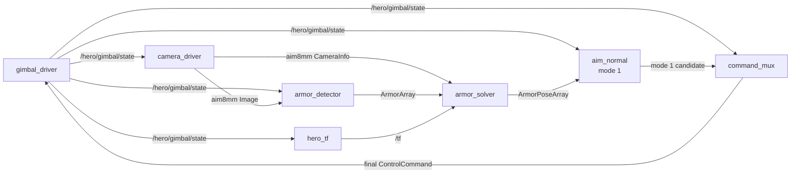
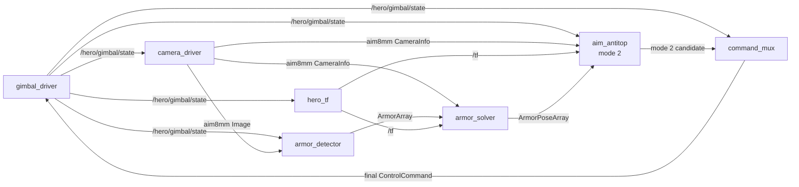
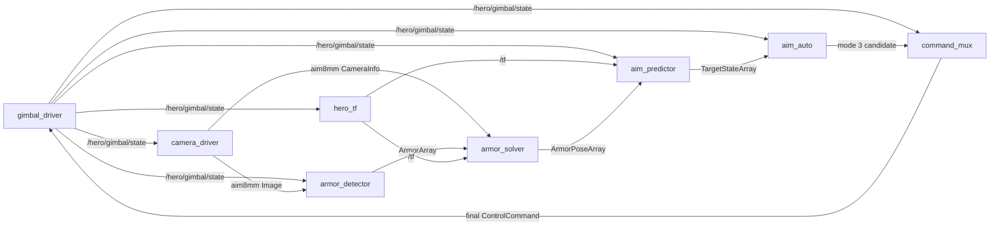
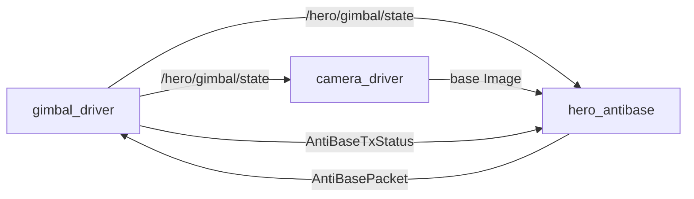

# 节点与 Topic 链路速查

## Mode 1：普通瞄准

## Mode 2：反前哨

## Mode 3：预测自瞄

## Mode 4：反基地

mode 4 不经过检测、PnP、TF 或 `command_mux`。

## Node 总表

| 节点 | 对应 mode | 订阅 | 发布 | 职责 |
| --- | --- | --- | --- | --- |
| `gimbal_driver` | 全部 | `/hero/gimbal/control`、`/hero/antibase/packets` | `/hero/gimbal/state`、`/hero/antibase/tx_status` | 串口状态、普通控制和反基地数据发送 |
| `hero_tf` | 全部 | `/hero/gimbal/state` | `/tf`、`/tf_static` | 发布 `world → gimbal_link → camera_link → camera_optical_frame` |
| `camera_driver` | aim8mm：1–3；base：4 | `/hero/gimbal/state` | aim8mm 图像/内参；base 图像 | 相机采集与按 mode 路由 |
| `armor_detector` | 1–3 | aim8mm 图像、`/hero/gimbal/state` | `/hero/detector/armors`、检测图 | 识别二维装甲板 |
| `armor_solver` | 1–3 | 检测结果、aim8mm 内参、TF | `/hero/solver/armor_poses`、Marker | PnP 与同刻 TF 变换 |
| `aim_normal` | 1 | 三维装甲板、`/hero/gimbal/state` | mode 1 候选、debug、Marker | 普通瞄准 |
| `aim_antitop` | 2 | 三维装甲板、aim8mm 内参、`/hero/gimbal/state`、TF | mode 2 候选、debug、Marker | 前哨跟踪、周期与开火许可 |
| `aim_predictor` | 3 | 三维装甲板、`/hero/gimbal/state`、TF | 目标预测状态、Marker | 多车 EKF 与四装甲板预测 |
| `aim_auto` | 3 | 目标预测状态、`/hero/gimbal/state` | mode 3 候选、debug、Marker | 选板、弹道、未来瞄点与开火门限 |
| `command_mux` | 1–3 | 三路候选、`/hero/gimbal/state` | `/hero/gimbal/control` | 只放行当前 mode 的新鲜候选 |
| `hero_antibase` | 4 | base 图像、`/hero/gimbal/state`、发送状态 | 反基地包、debug、可选图 | H.264 编码、码率控制与分包 |

## 共享感知与坐标 Topic

| Topic | 类型 | 发布者 | 订阅者 | 语义 |
| --- | --- | --- | --- | --- |
| `/hero/gimbal/state` | `GimbalState` | `gimbal_driver` | `camera_driver`、`armor_detector`、`hero_tf`、全部策略、`command_mux`、`hero_antibase` | mode、颜色、yaw、pitch 与状态时间 |
| `/tf` | `TFMessage` | `hero_tf` | `armor_solver`、`aim_predictor`、`aim_antitop` | 随云台状态变化的 `world → gimbal_link` |
| `/tf_static` | `TFMessage` | `hero_tf` | TF 使用者 | 固定的相机外参和光学坐标转换 |
| `/hero/camera/aim8mm/image_raw` | `sensor_msgs/Image` | `camera_driver` | `armor_detector` | mode 1–3 的主瞄准图像，`header.stamp = T0` |
| `/hero/camera/aim8mm/camera_info` | `sensor_msgs/CameraInfo` | `camera_driver` | `armor_solver`、`aim_antitop` | 与 aim8mm 图像同 `T0` 的内参 |
| `/hero/camera/base/image_raw` | `sensor_msgs/Image` | `camera_driver` | `hero_antibase` | mode 4 的基地相机图像 |
| `/hero/detector/armors` | `ArmorArray` | `armor_detector` | `armor_solver` | 二维四角点、ID、颜色、置信度，保留 `T0` |
| `/hero/solver/armor_poses` | `ArmorPoseArray` | `armor_solver` | `aim_normal`、`aim_predictor`、`aim_antitop` | PnP 三维位姿；TF 成功时在 `world`，失败时在相机系 |

## 策略、仲裁与硬件 Topic

| Topic | 类型 | 发布者 | 订阅者 | 作用 |
| --- | --- | --- | --- | --- |
| `/hero/aim/normalaim/controller` | `ControlCommand` | `aim_normal` | `command_mux` | mode 1 候选，`header.stamp = Tcontrol` |
| `/hero/aim/antitop/controller` | `ControlCommand` | `aim_antitop` | `command_mux` | mode 2 候选，`header.stamp = Tcontrol` |
| `/hero/aim/autoaim/target_states` | `TargetStateArray` | `aim_predictor` | `aim_auto` | mode 3 的 `Tstate` 预测，另存 `measurement_stamp = T0` |
| `/hero/aim/autoaim/controller` | `ControlCommand` | `aim_auto` | `command_mux` | mode 3 候选，`header.stamp = Tcontrol` |
| `/hero/gimbal/control` | `ControlCommand` | `command_mux` | `gimbal_driver` | 唯一普通控制入口，仲裁后 `header.stamp = Tmux` |
| `/hero/antibase/packets` | `AntiBasePacket` | `hero_antibase` | `gimbal_driver` | mode 4 H.264 分包，保留源图像 `T0` |
| `/hero/antibase/tx_status` | `AntiBaseTxStatus` | `gimbal_driver` | `hero_antibase` | mode 4 发送队列、码率控制与最近 `Tsend` |

## 调试与可视化 Topic

| Topic | 类型 | 发布者 | 内容 |
| --- | --- | --- | --- |
| `/hero/detector/visualization` | `sensor_msgs/Image` | `armor_detector` | 识别框、ID、颜色与置信度图像 |
| `/hero/solver/markers` | `visualization_msgs/MarkerArray` | `armor_solver` | 三维装甲板 Marker |
| `/hero/aim/normalaim/debug` | `NormalAimDebug` | `aim_normal` | mode 1 的观测 `T0`、选择与弹道结果 |
| `/hero/aim/normalaim/markers` | `visualization_msgs/MarkerArray` | `aim_normal` | mode 1 的观测板、选择板与瞄点 |
| `/hero/aim/antitop/debug` | `AntitopDebug` | `aim_antitop` | mode 2 的 `T0`、`Tzone`、`Tpermit` 与周期 |
| `/hero/aim/antitop/markers` | `visualization_msgs/MarkerArray` | `aim_antitop` | mode 2 的观测、旋转模型与瞄点 |
| `/hero/aim/autoaim/predictor/markers` | `visualization_msgs/MarkerArray` | `aim_predictor` | mode 3 的 `Tstate` 预测板与 `T0` 观测板 |
| `/hero/aim/autoaim/debug` | `AutoAimDebug` | `aim_auto` | mode 3 的 `T0`、`Tstate`、`Tcontrol`、`Taim` |
| `/hero/aim/autoaim/controller/markers` | `visualization_msgs/MarkerArray` | `aim_auto` | mode 3 的 `Taim` 预测板与瞄点 |
| `/hero/antibase/debug` | `AntiBaseDebug` | `hero_antibase` | mode 4 编码、队列、码率与发送状态 |
| `/hero/antibase/visualization` | `sensor_msgs/Image` | `hero_antibase` | 可选的反基地输出图像 |

## ROS 外部边界

| 边界 | 发送方 | 接收方 | 作用 |
| --- | --- | --- | --- |
| 普通串口帧 | `gimbal_driver` | 下位机 | yaw、pitch、开火与目标 ID |
| 反基地串口分片 | `gimbal_driver` | 下位机 | 每个 `AntiBasePacket` 的 H.264 数据 |
| UDP `127.0.0.1:9999` | `gimbal_driver`，仅本地开关开启 | `hero_judge.py` | 本地反基地裁判模拟 |
| MQTT `CustomByteBlock` | `hero_judge.py` | 本地 Mosquitto/比赛客户端 | 裁判模拟器转发的比赛格式数据 |

## 四个 mode 的最短路径

| Mode | 路径 |
| --- | --- |
| 1 普通瞄准 | aim8mm → detector → solver → aim_normal → command_mux → gimbal_driver |
| 2 反前哨 | aim8mm → detector → solver → aim_antitop → command_mux → gimbal_driver |
| 3 预测自瞄 | aim8mm → detector → solver → aim_predictor → aim_auto → command_mux → gimbal_driver |
| 4 反基地 | base → hero_antibase → gimbal_driver |
